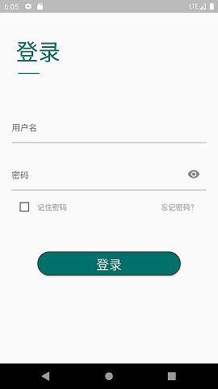

   
  
   

  
  
  

  <a href="#getting-started">Getting started</a>
  <a href="#contributors">Contributors</a>
  <a href="#license">License</a>

## Preview

## Getting Started

This project is a starting point for a Flutter application.

A few resources to get you started if this is your first Flutter project:

- [Lab: Write your first Flutter app](https://flutter.dev/docs/get-started/codelab)
- [Cookbook: Useful Flutter samples](https://flutter.dev/docs/cookbook)

For help getting started with Flutter, view our
[online documentation](https://flutter.dev/docs), which offers tutorials,
samples, guidance on mobile development, and a full API reference.

## Contributors
- [kaisawind](https://github.com/kaisawind) - creator, maintainer

## License

All original code in this repository is licensed under [MIT](https://github.com/kaisawind/flutter_login/blob/master/LICENSE) license.

